# Streamer.bot

<a href="https://streamer.bot">Streamerbot Website</a>

WooperBot_2123

## Actions

### Auto Shoutout

Automatically shoutouts whoever raided.

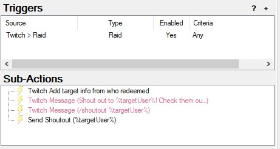

### Bot is mean or nice to you

Channel point reward on Twitch to give a random response to the redeemer.

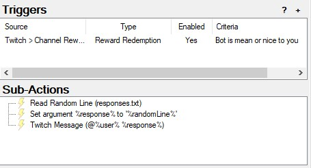

### Discord Live Notification

Posts in discord when stream goes live with the title of the Twitch stream.

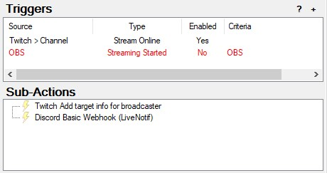

### Mod List

Generates a list of mods directly from the OpenKH mod manager.

(it's setup for kh2, but could be setup for other games)

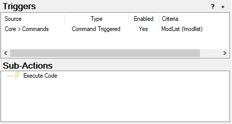

```
using System;
using System.IO;
using System.Collections.Generic;

public class CPHInline
{
	public bool Execute()
	{
		// Excluded values
		List<string> excludes = new List<string>();
		excludes.Add("randoseed");
		excludes.Add("KH2FM-Mods-equations19/auto-save");
		excludes.Add("KH2FM-Mods-equations19/soft-reset");
		excludes.Add("KH2FM-Mods-Num/GoA-ROM-Edition");

		// Get mod list
		List<string> mods = new List<string>();
		foreach(string line in File.ReadLines("path to mods-KH2.txt"))
		{
			if (!excludes.Contains(line))
			{
				mods.Add(line);
			}
		}
		string result = String.Join(" | ", mods);
		CPH.SendMessage(result, true);
		return true;
	}
}
```

### Ads Manager

Sends message in Twitch chat to notify of upcoming ads, when ads are running, and when ads are finished.

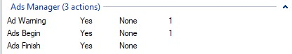

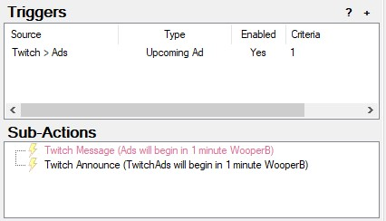

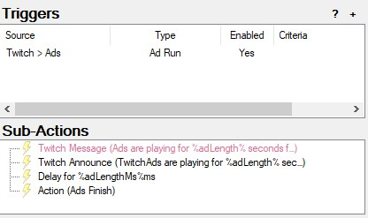

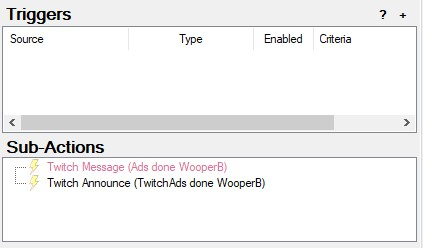

### Music Manager

Sends the current song title as a message in Twitch chat.

(there's a problem with it repeating itself)

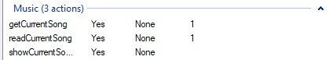

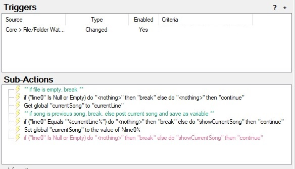

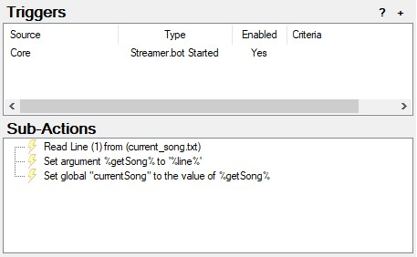

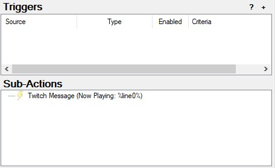

### Timeout Point Reward

[From streamerbot extensions](https://extensions.streamer.bot/t/timeout-user-reward/155)
