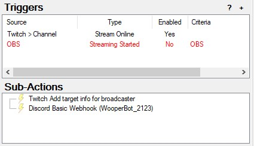

# Streamer.bot

<a href="https://streamer.bot">Streamerbot Website</a>

Actions for chat bot **WooperBot_2123**

<!-- TOC start (generated with https://github.com/derlin/bitdowntoc) -->

- [Actions](#actions)
  - [Auto Shoutout](#auto-shoutout)
  - [Bot is mean or nice to you](#bot-is-mean-or-nice-to-you)
  - [Discord Live Notification](#discord-live-notification)
  - [Mod List](#mod-list)
  - [Ads Manager](#ads-manager)
  - [Music Manager](#music-manager)
    - [Get Spotify Playlist](#get-spotify-playlist)
  - [Timeout Point Reward](#timeout-point-reward)
  - [Text-to-Speech Reward](#text-to-speech-reward)

<!-- TOC end -->

<!-- TOC --><a name="actions"></a>

## Actions

<!-- TOC --><a name="auto-shoutout"></a>

### Auto Shoutout

Automatically shoutouts whoever raided.


<!-- TOC --><a name="bot-is-mean-or-nice-to-you"></a>

### Bot is mean or nice to you

Channel point reward on Twitch to give a random response to the redeemer.


<!-- TOC --><a name="discord-live-notification"></a>

### Discord Live Notification

Posts in discord when stream goes live with the title of the Twitch stream.



<!-- TOC --><a name="mod-list"></a>

### Mod List

Generates a list of mods directly from the OpenKH mod manager.

(it's setup for kh2, but could be setup for other games)


```
using System;
using System.IO;
using System.Collections.Generic;

public class CPHInline
{
	public bool Execute()
	{
		// Excluded values
		List<string> excludes = new List<string>();
		excludes.Add("randoseed");
		excludes.Add("KH2FM-Mods-equations19/auto-save");
		excludes.Add("KH2FM-Mods-equations19/soft-reset");
		excludes.Add("KH2FM-Mods-Num/GoA-ROM-Edition");

		// Get mod list
		List<string> mods = new List<string>();
		foreach(string line in File.ReadLines("path to mods-KH2.txt"))
		{
			if (!excludes.Contains(line))
			{
				mods.Add(line);
			}
		}
		string result = String.Join(" | ", mods);
		CPH.SendMessage(result, true);
		return true;
	}
}
```

<!-- TOC --><a name="ads-manager"></a>

### Ads Manager

Sends announcement in Twitch chat to notify of upcoming ads, when ads are running, and when ads are finished.


<!-- TOC --><a name="music-manager"></a>

### Music Manager

Sends the current song title as a message in Twitch chat.

(there's a problem with it repeating itself if used with Nightbot App)


<!-- TOC --><a name="get-spotify-playlist"></a>

#### Get Spotify Playlist

Sends the current Spotify playlist as a message in Twitch chat.


```
using System;
using System.IO;
using System.Text;
using System.Collections.Generic;

public class CPHInline
{
	public bool Execute()
	{
		// Get playlist url and name from Tuna
        string[] lines = File.ReadAllLines(@"path to playlist-url.txt");
        string[] lines2 = File.ReadAllLines(@"path to playlist-name.txt");
        string line = lines[0];
        string name = lines2[0];

        // Extract ID after "spotify:playlist:"
        string prefix = "spotify:playlist:";
        string id = line.StartsWith(prefix) ? line.Substring(prefix.Length) : "Invalid URL format";

		// Convert to url
        string url = "https://open.spotify.com/playlist/" + id;

        CPH.SendMessage("You're listening to the sweet sounds of " + name + ": " + url + " WooperB", true);
		return true;
	}
}
```

<!-- TOC --><a name="timeout-point-reward"></a>

### Timeout Point Reward

[From streamerbot extensions](https://extensions.streamer.bot/t/timeout-user-reward/155)

<!-- TOC --><a name="text-to-speech-reward"></a>

### Text-to-Speech Reward

Allows subscribed users to redeem a channel point reward for text-to-speech. The user can choose from different voices.


The bot will refund the user if they are not subscribed.


The rewards can be toggled through chat commands.


